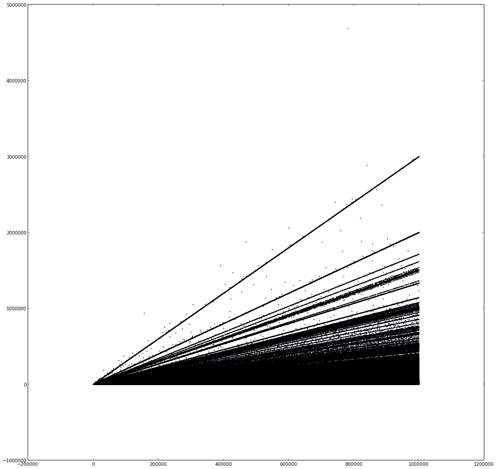
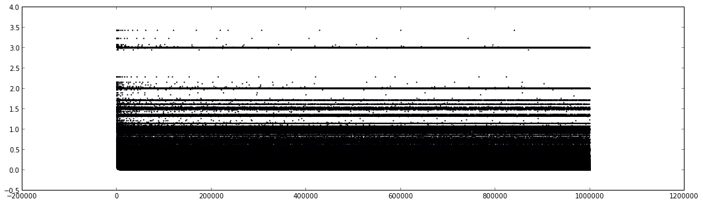

# fibonacci-tune

Playing around with pisano periods.

## What is this madness?
I was actually turned on to this by this [youtube video by numberphile](https://www.youtube.com/watch?v=Nu-lW-Ifyec). But I'll give a brief rundown:

This is the code for [the fibonacci sequence](http://en.wikipedia.org/wiki/Fibonacci_number), in case you're not familiar.
```python
def fib():
    a = b = 1
    while True:
        yield a
        a, b = b, a + b
```

Here are the first 30 terms.
```
1, 1, 2, 3, 5, 8, 13, 21, 34, 55, 89, 144, 233, 377, 610, 987, 1597, 2584, 4181, 6765, 10946, 17711, 28657, 46368, 75025, 121393, 196418, 317811, 514229, 832040
```

A pisano period is the length of the repeating sequence resulting from taking the fibonacci sequence MOD an integer N.

So those above terms MOD 5 gives you:
```
1, 1, 2, 3, 0, 3, 3, 1, 4, 0, 4, 4, 3, 2, 0, 2, 2, 4, 1, 0, [now we start repeating] 1, 1, 2, 3, 0, 3, 3, 1, 4, 0
```
And the `pisano period` for 5 is therefore 20.

And it's interesting because the periods don't immediately follow a recognizable pattern. For example, the periods for 2 <= n <= 20 are:

```
n: 2, 3, 4,  5,  6,  7,  8,  9, 10, 11, 12, 13, 14, 15, 16, 17, 18, 19, 20
p: 3, 8, 6, 20, 24, 16, 12, 24, 60, 10, 24, 28, 48, 40, 24, 36, 24, 18, 60
```
## The data

a scatter plot of `(n, period(n))` for `4 <= n <= 1 million`



While it's rather "noisy", there are definitely some immediately recognizable patterns. There's a line where `p ~= 3n`, one for `p ~= 2n`, etc. So lets divide by n to see things more clearly.

## Period / N

scatter plot of `(n, period(n)/n)`



Now we can get in closer to see what's happening. I chose `y=3` because it's very distinct and there's not too much noise around it.

## Finding patterns

And here we are zoomed in to `2.9 <= y <= 3.1`. You can't tell from the image, but there are only about 50 points where `p` _exactly_ equals `3n`. The rest are only very close, so I plotted a few lines to see what I could figure out.


The lines plotted:

```js
y = 6        / x + 3
y = 6 * 5    / x + 3
y = 6 * 5**2 / x + 3
y = 6 * 5**3 / x + 3
y = 6 * 5**4 / x + 3
y = 6 * 5**5 / x + 3

y = -6 * 5    / x + 3
y = -6 * 5**2 / x + 3
y = -6 * 5**3 / x + 3
```

As you can see, there are many more points that seem to be following curves, but I can't tell just by eyeballing what they are. So next I'm going to take a more numeric as opposed to visual approach.

That's all I've got so far!