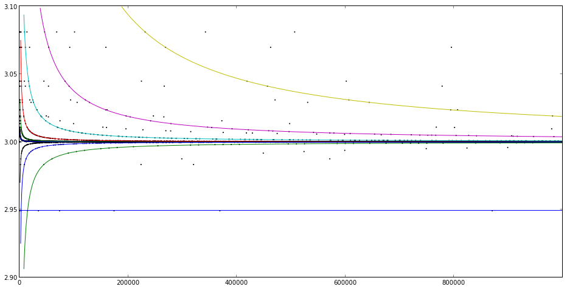

# fibonacci-tune

Playing around with pisano periods.

## The data

`y: how long is the pisano period where n=x`


## Period / N

`y: period(x)/x`


## Finding patterns in the (period/n)s around 3

The lines plotted:

```js
y = 6        / x + 3
y = 6 * 5    / x + 3
y = 6 * 5**2 / x + 3
y = 6 * 5**3 / x + 3
y = 6 * 5**4 / x + 3
y = 6 * 5**5 / x + 3

y = -6 * 5    / x + 3
y = -6 * 5**2 / x + 3
y = -6 * 5**3 / x + 3
```


